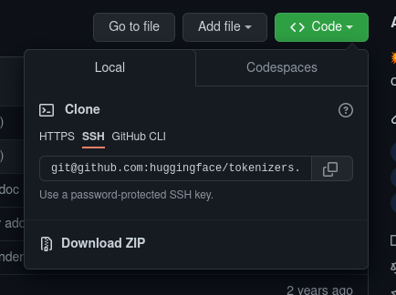

# Environment Setup

Ready to get started ?

First things first, we're going to setup the tools you'll be needing to write some code.

## Operating System

I highly advise to get Linux as this is most likely where your code will end up running most of the time (unless you want to make video games or work on embedded software).

For that there are multiple solutions.

### Windows

If you're running Windows on your computer, you can [install WSL](https://docs.microsoft.com/en-us/windows/wsl/install).

So, either in `cmd.exe` or PowerShell run :

```sh
wsl --install
```

WSL stands for Windows Subsystem for Linux. It basically allows you to run Linux as a program on your Windows machine.

Once that is done, you may or may not have to reboot, I don't remember.

Next step, download ubuntu on the [Microsoft Store](https://www.microsoft.com/en-us/p/ubuntu/9nblggh4msv6#activetab=pivot:overviewtab). Ubuntu is a Linux distribution maintained by Canonical.

You should then be able to start your WSL by typing ubuntu in your program search bar. Once you launched it, you should see a terminal !

### MacOs

If you're running Mac, you should be fine even though all tools aren't necessarily the same.

## Terminal

The terminal is one of the programmer's most important tools. It's a graphical user interface for your shell.
A shell is an interface that executes commands you type in it.

```sh
                        ------------- This is where you type your commands
                        |
        |------------------------------|
prompt>  # blabla blabla.bl --bla | yes
  ^
  |
  --- this is your prompt, it usually displays information about your current path, time, etc
```

Let's give that a shot, open a terminal and type : `ls`.

You should see a list of files that are in your current directory. How do you know in what directory you currently are in ? Either it's displayed in your shell prompt, either you can type : `pwd`.

Also, to `c`hange the current `d`irectory use `cd`.

Try the following :

```sh
# the ~ character, tilde, is a symbol that refers to your home directory
mkdir ~/my_super_project # mkdir stand for make directories
cd ~/my_super_project
pwd
'/home/me/my_super_project'
```

## Text Editor

Another one  of the most important tools is the text editor. This is how you write your code in files.

We're going to be using [vim](https://www.vim.org/). Don't worry about installing it, it's already there on Ubuntu.

## Package manager

Linux comes by default with a program installed that allows you to manage other packages (hence 'package manager').

Each platform (Debian, RHEL, OpenSuse, etc) comes with their version (respectively `apt`, `yum`, `zypper`).

This is one way of installing programs on your system, you can always download a binary from internet and run it or compile the source code to create the binary and then run it (this is usually a more involved process).

So if you want to install a new package, run the following :

```sh
# if it has been a while
sudo apt update
sudo apt install some_package
```

## git

git is what we call a source version control system. It is composed of a server that keeps a copy of your files and a client, the `git` command.

To install `git` check out the [official documentation](https://git-scm.com/book/en/v2/Getting-Started-Installing-Git).

#### A quick shorter on git

It saves every change that happened in the folder it is initialised in.

If you run `ls -la` you should see a `.git` folder (in a folder you cloned or when you run `git init`). This is where all the data changes are saved. This is great in case you need to revert to an old version or keep track of new features.
You can view the commit history by running `git log`.

To clone your repository, you need to got to Github and find it on the website. Then, find the clone url. For example, if I want to clone https://github.com/huggingface/tokenizers I click on the green `Code` button and copy the git url :



Finally, for the tokenizers repository I'll run : `git clone git@github.com:huggingface/tokenizers.git` (it won't be the same url for your repo).

## Your first program

Let's write our first program !

Type `vi write_42.c` in your shell.

You're now in your text editor. To write something in the file, press `i`. This will put you in Insert mode.

Next, type the following :

```c
#include <unistd.h>

int main() {
    write(1, "42", 2);
}
```

Now we want to go back to Normal mode, for that press Escape.

But how do we exit vim ? :thinking:

Well, now that you're in Normal mode, you're going to type a command to `w`rite the file to disk and `q`uit vim. Type the following : `:wq` (you should see it show in the bottom left corner of your editor) and Enter. This saved the content you wrote in the file and exitted vim.

To check everything we wrote in the file we can use the `cat` command.

Run : `cat write_42.c`.

Don't worry if you don't understand what's going on for now, this is only to test if everything is set up properly.

### Compiling your code

To be able to run a program your wrote, you need to transform it to something your computer can understand. This is what we call compiling.

In C, you will very often use [gcc](https://gcc.gnu.org/).

Basically what the compiler does is read your code file, check if the syntax is correct, parse it and then outputs a binary file (0s and 1s) that the computer can execute.

To install gcc on Ubuntu, I believe you need to run : `sudo apt install gcc`.

Once you're done with editing your program, let's compile it and see if it runs.

```sh
cc write_42.c

./a.out
```

And that should print `42` !

## Assignement

Finally, I'm going to need to see that you wrote the program correctly.

For that you're going to push the file to github with `git`.

Once you cloned or init git in your folder and wrote your program, you can type `git status`. It should tell you what has been modified.

Then, you want to create a commit, see this as a new version. For that, you need to add the files to the commit, then commit and push.

Basically, see your commit as an open box in which you `add` files. Once you `commit`, you close the box and seal it. Finally, you `push` that box to the remote server so that it can keep a copy of your changes.

Why do you need a remote server you ask ? Well, imagine you lose your data in a fire, car crash, because of a virus, spilled tea or beer on your keyboard, etc etc etc. You'll be very happy to have a remote copy, especially if it's code that allows your company to make big $$$ !

We use github as our, let's call it git-server-as-a-service. You don't need to know how they manage the servers, just know that once it's pushed there it's safe from disasters.

These are the commands you'll want to run to upload your files to github :

```sh
git add write_42.c
git commit -m "My first program !"
git push
```

